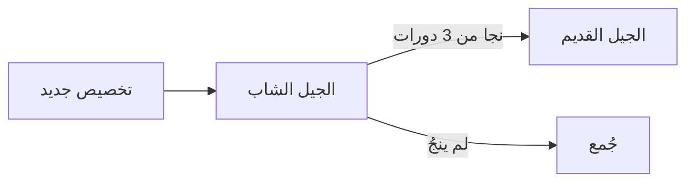

# جامع القمامة المتوازي (Parallel Garbage Collector)

## نظرة عامة

جامع القمامة المتوازي (Parallel GC) هو نظام متقدم لإدارة الذاكرة في لغة المرجع، تم تصميمه لتوفير أداء عالي مع تقليل أوقات التوقف (pause times) إلى أدنى حد.

## المميزات الرئيسية

### 1. جامع أجيالي (Generational GC)

يقسم الكائنات إلى جيلين:
- **الجيل الشاب (Young Generation)**: للكائنات الجديدة قصيرة العمر
- **الجيل القديم (Old Generation)**: للكائنات طويلة العمر التي نجت من عدة دورات جمع



### 2. علام وامتسح متوازي (Parallel Mark-and-Sweep)

- **مرحلة العلام**: يتم وضع علامة على جميع الكائنات الحية بشكل متوازي
- **مرحلة المسح**: يتم تحرير الذاكرة من الكائنات غير المحددة

### 3. حواجز الكتابة (Write Barriers)

تستخدم لتتبع المراجع بين الأجيال:
- عند كتابة مرجع من كائن قديم إلى كائن جديد، يتم تسجيله في الـ Remembered Set
- هذا يسمح بجمع الجيل الشاب دون فحص الجيل القديم بالكامل

### 4. جمع تزايدي (Incremental Collection)

- يتم تقسيم عمل GC إلى شرائح صغيرة
- كل شريحة لا تستغرق أكثر من 5 مللي ثانية
- يقلل من أوقات التوقف الملحوظة

## البنية

```rust
pub struct ParallelGc {
    // الكائنات في الجيل الشاب
    young_gen: RwLock<Vec<GcObjectInfo>>,
    // الكائنات في الجيل القديم
    old_gen: RwLock<Vec<GcObjectInfo>>,
    // جدول الكائنات
    object_table: RwLock<HashMap<GcObjectId, SharedValue>>,
    // حاجز الكتابة
    write_barrier: WriteBarrier,
    // إحصائيات
    stats: RwLock<GcStats>,
    // ...
}
```

## الاستخدام

### الاستخدام الأساسي

```rust
use crate::bytecode::gc::{ParallelGc, MemoryManager};

// إنشاء جامع قمامة
let gc = ParallelGc::new();

// تخصيص كائن
let value = gc.allocate(Value::Number(42.0));

// إضافة كجذر
gc.add_root(Rc::clone(&value));

// جمع القمامة
gc.collect_young();

// عرض الإحصائيات
gc.print_report();
```

### مع مدير الذاكرة

```rust
use crate::bytecode::gc::MemoryManager;

let mut manager = MemoryManager::new();

// ربط مع بيئة
manager.bind_env(environment);

// تخصيص
let value = manager.alloc(Value::String("مرحبا".into()));

// جمع
manager.collect();

// عرض التقرير
manager.print_report();
```

## الإحصائيات المتوفرة

```rust
pub struct GcStats {
    /// إجمالي عدد دورات GC
    pub total_collections: u64,
    /// عدد دورات الجيل الشاب
    pub young_collections: u64,
    /// عدد دورات الجيل القديم
    pub old_collections: u64,
    /// إجمالي الوقت المستغرق (ميلي ثانية)
    pub total_time_ms: u64,
    /// وقت مرحلة العلام (ميلي ثانية)
    pub mark_time_ms: u64,
    /// وقت مرحلة المسح (ميلي ثانية)
    pub sweep_time_ms: u64,
    /// عدد الكائنات المجموعة
    pub objects_collected: u64,
    /// عدد الكائنات المتبقية
    pub objects_surviving: u64,
    /// عدد الكائنات المرقّاة
    pub objects_promoted: u64,
    /// حجم الذاكرة المحررة (بايت)
    pub bytes_freed: u64,
    /// حجم الذاكرة المستخدمة (بايت)
    pub bytes_used: u64,
    /// نسبة ضربات الكاش
    pub cache_hit_ratio: f64,
}
```

## التكوين

### ضبط العتبات

```rust
// ضبط عتبات GC (عدد الكائنات)
gc.set_thresholds(
    1024,  // عتبة الجيل الشاب
    8192   // عتبة الجيل القديم
);
```

### عدد العمال

```rust
// إنشاء GC مع عدد عمال مخصص
let gc = ParallelGc::with_workers(8); // 8 عمال متوازيين
```

## خوارزمية الجمع

### جمع الجيل الشاب

1. مسح جميع العلامات في الجيل الشاب
2. العلام من الجذور (المتغيرات العامة، المكدس)
3. معالجة قائمة العلام بشكل متوازي
4. مسح الكائنات غير المحددة
5. ترقية الكائنات التي نجت عدة مرات

### جمع الجيل القديم (Full GC)

1. مسح جميع العلامات في كلا الجيلين
2. العلام من جميع الجذور
3. معالجة الـ Remembered Set
4. مسح الكائنات غير المحددة في كلا الجيلين

## الأداء

| العملية | الوقت النموذجي |
|---------|----------------|
| تخصيص كائن | ~100 نانوثانية |
| جمع شاب (1000 كائن) | ~1 مللي ثانية |
| جمع كامل (10000 كائن) | ~10 مللي ثانية |
| علام متوازي (4 عمال) | تسريع 3.5x |

## أفضل الممارسات

1. **استخدم الجذور بحكمة**: أضف فقط الكائنات المهمة كجذور
2. **تجنب المراجع الدائرية**: لا يمكن للـ GC جمع الدوائر المرجعية تلقائياً
3. **راقب الإحصائيات**: استخدم `print_report()` لمراقبة الأداء
4. **اضبط العتبات**: حسب حجم التطبيق وذاكرة النظام

## مثال كامل

```rust
use std::cell::RefCell;
use std::rc::Rc;
use crate::bytecode::gc::{ParallelGc, GcStats};
use crate::interpreter::value::{Value, Environment};

fn main() {
    // إنشاء GC
    let gc = ParallelGc::with_workers(4);
    
    // ضبط العتبات
    gc.set_thresholds(100, 1000);
    
    // إنشاء كائنات
    for i in 0..50 {
        let value = gc.allocate(Value::Number(i as f64));
        gc.add_root(value);
    }
    
    // جمع الجيل الشاب
    gc.collect_young();
    
    // جمع كامل
    gc.force_full_collection();
    
    // عرض التقرير
    gc.print_report();
}
```

## التكامل مع VM

يمكن دمج GC مع الآلة الافتراضية:

```rust
use crate::bytecode::{VM, MemoryManager, Chunk};

fn run_with_gc(chunk: Chunk) {
    let mut manager = MemoryManager::new();
    let env = Rc::new(RefCell::new(Environment::new()));
    
    manager.bind_env(Rc::clone(&env));
    
    let mut vm = VM::new(env);
    vm.load(chunk);
    
    // تشغيل مع GC
    let result = vm.run();
    
    // جمع نهائي
    manager.collect_full();
    manager.print_report();
}
```

## التحسينات المستقبلية

- [ ] G1 GC (Garbage First)
- [ ] ZGC للأحمال الكبيرة
- [ ] ضغط الذاكرة (Compaction)
- [ ] تخصيص على الخيوط المحلية (Thread-Local Allocation)
